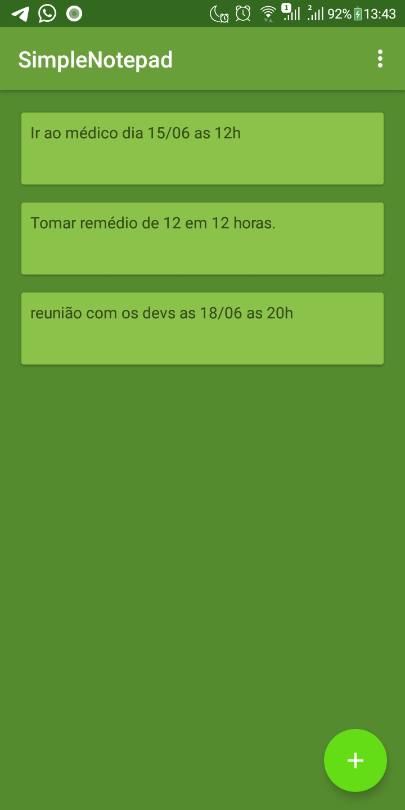
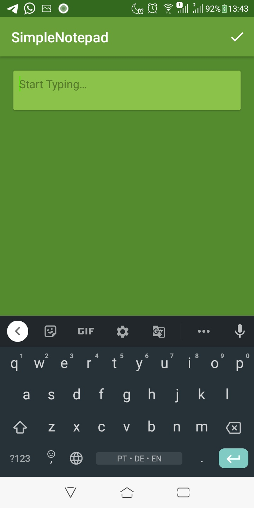
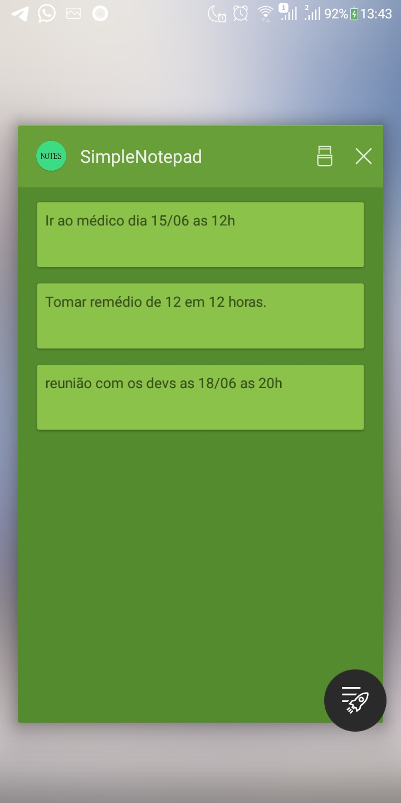

# SimpleNotePad
The app goals is working as a simple notepad use to make all notes you need to do.
### App Screenshots

---
### App APK to download

You can download app [here](./exemple/app-debug.apk)
---
### License

Copyright 2019-2021 Janilson Serra.

Licensed to the Apache Software Foundation (ASF) under one or more contributor
license agreements.  See the NOTICE file distributed with this work for
additional information regarding copyright ownership.  The ASF licenses this
file to you under the Apache License, Version 2.0 (the "License"); you may not
use this file except in compliance with the License.  You may obtain a copy of
the License at

http://www.apache.org/licenses/LICENSE-2.0

Unless required by applicable law or agreed to in writing, software
distributed under the License is distributed on an "AS IS" BASIS, WITHOUT
WARRANTIES OR CONDITIONS OF ANY KIND, either express or implied.  See the
License for the specific language governing permissions and limitations under
the License.
---
### Found me

- Email: j.janilson12@gmail.com
- Linkedin : https://www.linkedin.com/in/janilsonalfser
 